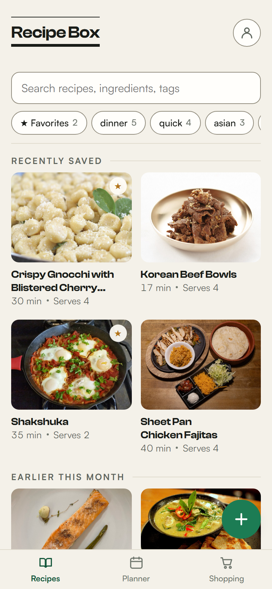
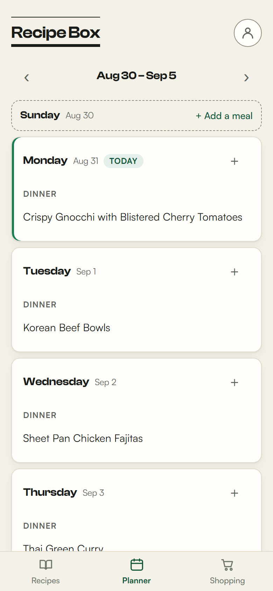
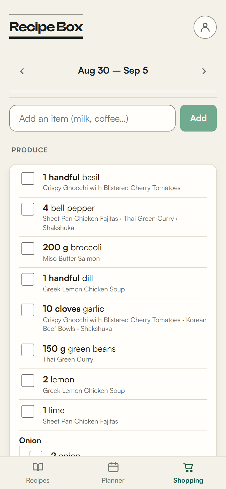

# Recipe Box

Personal PWA for saving recipes from anywhere, including recipe sites, TikTok and Instagram, into one searchable place. It also plans meals by the week and builds the shopping list from that plan. A self-hosted alternative to ReciMe.

**Live at [recipe-box-coral.vercel.app](https://recipe-box-coral.vercel.app).** Installable on iOS and Android.

<p align="center">
  
  
  
</p>

<sub>Screenshots use seeded demo recipes. Dish photographs from [Wikimedia Commons](https://commons.wikimedia.org).</sub>

## What it does

- **Save from anywhere.** Paste a recipe URL and it reads the site's schema.org data directly, no AI involved. Paste a TikTok or Instagram link and Claude Haiku structures the caption into ingredients and steps. Photograph a recipe out of a cookbook and it reads that too. Anything it cannot parse is kept as a link card rather than thrown away.
- **Plan the week.** Assign recipes to days and meals, swipe to move or remove them.
- **Shop from the plan.** The list is derived from the week's plan every time it renders, so it cannot drift out of sync. Ingredients merge across recipes, group by supermarket aisle, and keep a per-recipe breakdown so a doubled quantity is explainable.
- **Cook from it.** Full-screen cook mode with tickable steps, a serving scaler that rewrites quantities in place, and timers parsed out of the step text. Holds a wake lock so the screen stays on.
- **Works offline.** Reads are mirrored to local storage, so the app opens and shows your recipes with no connection.

## Stack

- **Frontend:** React 19 + Vite PWA (installable, offline shell, share target) → Vercel
- **Backend:** FastAPI as a single Vercel Python Function → Vercel
- **Storage:** Supabase (Postgres + magic-link auth, RLS per user), localStorage fallback
- **AI:** Claude Haiku structures recipes out of TikTok/Instagram captions

## Dev setup

```bash
# Backend — port 8002 (mtg-web owns 8001)
cd backend
pip install -r requirements.txt
uvicorn app.main:app --port 8002

# Frontend
cd frontend
npm install
npm run dev   # http://localhost:5173
```

`frontend/.env` needs `VITE_API_BASE=http://localhost:8002`. For cloud sync, also set `VITE_SUPABASE_URL` + `VITE_SUPABASE_ANON_KEY` (dedicated Supabase project, run `supabase/schema.sql` there first); leave them unset to run local-only.

The backend needs `ANTHROPIC_API_KEY` for social and photo import. Without it the app still imports recipe websites and saves social posts as link cards.

## How this was built

Claude Code did most of the implementation here. The architecture decisions, the code review, and the debugging were mine, and I am accountable for everything that shipped.

That workflow is visible in the repo rather than just claimed. `CLAUDE.md` is the working context I maintain for the tool, and it is where a decision goes once it turns out to be load-bearing: why the shopping list is derived instead of stored, why an Instagram cover photo needs its play-button overlay divided back out instead of painted over, why every outbound fetch of a user URL has to be re-checked after redirects. The commit history is a record of incremental reviewed changes rather than one bulk import.

Two things worth calling out. `docs/AUDIT.md` is a security and quality pass I ran against the app before shipping v1.0, with the findings and what I did about each. And the tests in `frontend/src/lib/*.test.js` and `backend/tests/` deliberately cover the pure logic rather than the UI, because that is where a wrong answer is silent: an ingredient parser that quietly drops an item produces a plausible shopping list, and you only find out in the shop.

## Docs

- `docs/SPEC.md` — the original plan and phase breakdown
- `docs/AUDIT.md` — pre-launch security and quality audit
- `CLAUDE.md` — architecture decisions and the reasoning behind them
